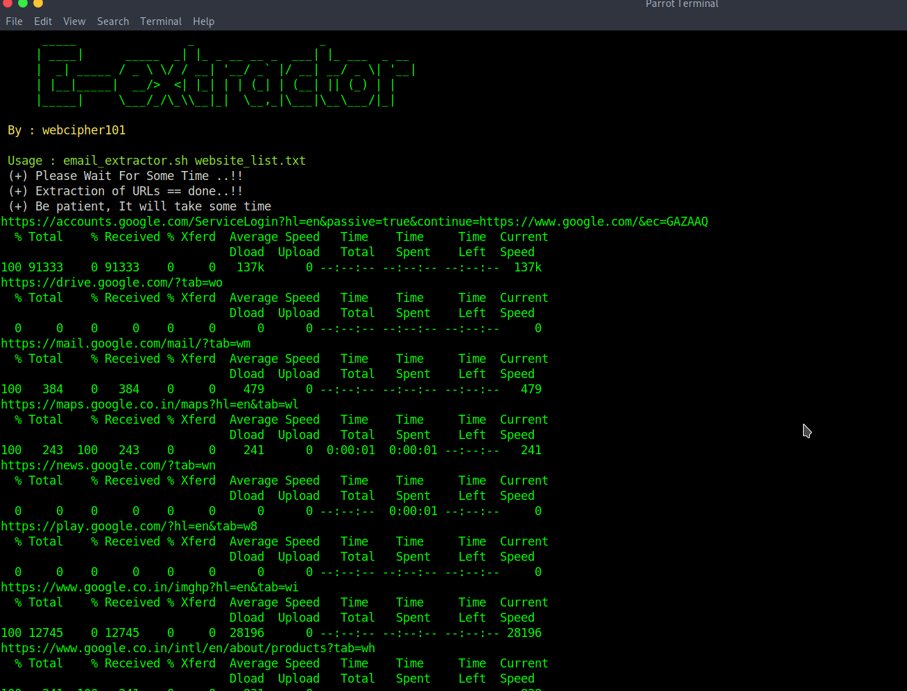

# mails_extractor_from_websites
# by : webcipher101

# prerequisite :
sudo apt-get install lynx

# usage : 
chmod +x ./email_extractor.sh

make txt file and add your urls in that files example : email_file.txt

./email_extractor.sh emails_file.txt

# output : 

Check extracted_mails.txt

thanks , for using mail-extractor.

# <a href="https://twitter.com/webcipher101?s=09">@webcipher101</a>
